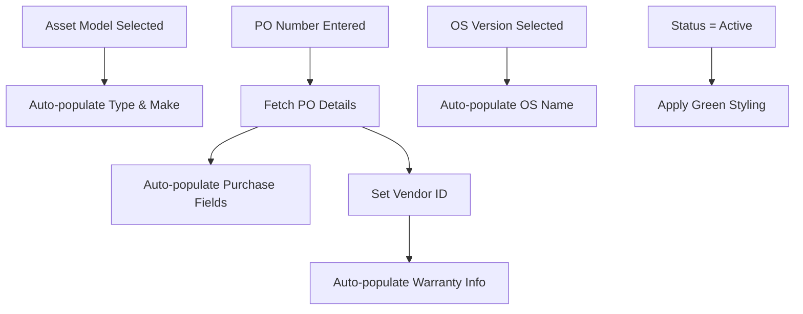

# Enhanced Asset Form - Complete Implementation

## 🎯 Overview
The Asset Edit Form has been completely enhanced with sophisticated dependent field population, auto-triggered calculations, and modern Tailwind CSS styling. The form now provides an intuitive user experience with intelligent field dependencies and visual feedback.

## ✅ **Editable Fields** (Always User-Editable)

### **Primary Fields**
- **Asset ID**: Shown only in edit mode (read-only)
- **Asset Name**: Required field with validation
- **Serial Number**: Required field with validation  
- **IT Asset Code**: Optional identifier field
- **MAC Address**: Network identifier with placeholder format
- **IPv4 Address**: IP address with validation pattern
- **Inventory Location**: Physical location (Building/Floor/Room)
- **Tags**: Comma-separated tags for categorization

### **Selection Fields**
- **Asset Model**: Dropdown that triggers auto-population
- **PO Number**: Editable field that auto-triggers purchase details

## 🔁 **Dependent Auto-Population Logic**

### **1. Asset Model Selection → Auto-populates:**
```typescript
// When user selects Asset Model:
modelId → triggers autoFillModelDetails()
├── selectedAssetType (read-only display)
└── selectedAssetMake (read-only display)
```

**Visual Indicators:**
- Asset Type: Blue background (`bg-blue-50 text-blue-800`)
- Asset Make: Blue background (`bg-blue-50 text-blue-800`)
- Helpful text: "Auto-populates Type & Make"

### **2. PO Number Entry → Auto-populates:**
```typescript
// When user enters PO Number:
poNumber → triggers autoFillPODetails()
├── invoiceNumber (read-only)
├── acquisitionType (editable but pre-filled)
├── acquisitionDate (editable)
├── acquisitionPrice (editable)
├── rentalAmount (editable)
├── leaseEndDate (editable)
├── vendorId → triggers autoFillVendorDetails()
│   ├── selectedVendor (purple display)
│   ├── extendedWarrantyVendorId (same as vendorId)
│   ├── selectedExtendedWarrantyVendor (purple display)
│   ├── warrantyExpiry (auto-calculated: +1 year)
│   └── extendedWarrantyExpiry (auto-calculated: +2 years)
```

**Visual Indicators:**
- Vendor: Purple background (`bg-purple-50 text-purple-800`)
- Auto-populated fields: Gray background (`bg-gray-50`)
- Helpful text: "Auto-fills purchase details"

### **3. OS Version Selection → Auto-populates:**
```typescript
// When user selects OS Version:
osVersionId → triggers autoFillOSDetails()
├── osId (hidden, used for backend)
└── selectedOSName (blue display)
```

**Visual Indicators:**
- OS Name: Blue background (`bg-blue-50 text-blue-800`)
- Helpful text: "Auto-populates OS"

## 🎨 **Status-Based Styling**

### **Active Status Highlighting**
```typescript
// Dynamic styling based on status
isActiveStatus = computed(() => 
  this.assetForm?.get('status')?.value === ASSET_STATUS.ACTIVE
);
```

**When Status = "Active":**
- Status dropdown: Green styling (`bg-green-100 text-green-800 border-green-300`)
- Success indicator: "✓ Active status" in green text
- Form validation passes for active assets

## 🏗️ **Form Structure & Layout**

### **3-Column Responsive Layout**
```html
<div class="grid grid-cols-1 md:grid-cols-3 gap-6">
  <!-- Column 1: Basic Information -->
  <!-- Column 2: Asset Details & Status -->  
  <!-- Column 3: Purchase & Warranty Info -->
</div>
```

### **Column 1: Basic Information** 📝
- Asset ID (edit mode only)
- Asset Name *
- Serial Number *
- IT Asset Code
- MAC Address
- IPv4 Address
- Inventory Location
- Tags

### **Column 2: Asset Details & Status** ⚙️
- Asset Model * (dropdown)
- Asset Type (auto-populated)
- Asset Make (auto-populated)
- Status * (with active highlighting)
- OS Version (dropdown)
- Operating System (auto-populated)
- Owner Type *
- Assigned User

### **Column 3: Purchase & Warranty Info** 💰
- PO Number (triggers auto-population)
- Acquisition Type (auto-populated)
- Invoice Number (auto-populated)
- Acquisition Date
- Acquisition Price
- Rental Amount
- Lease End Date
- Vendor (auto-populated)
- Warranty Expiry (auto-calculated)
- Extended Warranty Expiry (auto-calculated)

## 🔧 **Backend Integration**

### **Fixed Asset ID Handling**
```typescript
onSubmitAsset(): void {
  const formData = { ...this.assetForm.value };
  const isEdit = this.isEditMode();
  
  // Ensure asset_id is properly set for updates
  if (isEdit) {
    formData.assetId = this.selectedAsset()!.assetId!;
  } else {
    delete formData.assetId; // Remove for creation
  }
  
  const operation = isEdit 
    ? this.assetService.updateAsset(formData.assetId, formData)
    : this.assetService.createAsset(formData);
}
```

### **Service Methods Used**
- `getPOByNumber(poNumber)` - Fetch PO details
- `getAssetModelsWithDetails()` - Get models with type/make info
- `getOSVersions()` - Get OS version list
- `getOperatingSystems()` - Get OS list
- `getVendors()` - Get vendor list

## 🎨 **Tailwind CSS Styling Features**

### **Color-Coded Sections**
- **Blue**: Auto-populated model-related fields
- **Green**: Active status indicators
- **Purple**: Vendor and warranty information
- **Gray**: Read-only/disabled fields
- **Red**: Validation errors

### **Interactive Elements**
```css
/* Transition effects on all form elements */
transition-colors duration-200

/* Focus states */
focus:ring-2 focus:ring-blue-500 focus:border-blue-500

/* Error states */
border-red-500 text-red-500

/* Status-specific styling */
bg-green-100 text-green-800 border-green-300 /* Active status */
```

### **Icons & Visual Hierarchy**
- Section headers with contextual icons
- Color-coded section icons (blue, green, purple)
- Visual feedback for auto-populated fields
- Clear field grouping and spacing

## 📱 **Responsive Design**

### **Breakpoint Behavior**
- **Mobile**: Single column layout
- **Tablet+**: Three column layout (`md:grid-cols-3`)
- **Modal sizing**: `max-h-[80vh]` with scroll
- **Field spacing**: Consistent `space-y-4` within columns

### **Touch-Friendly**
- Adequate touch targets (44px minimum)
- Clear visual feedback on interactions
- Smooth transitions and animations

## 🔄 **Field Dependencies Flow**



## 🚀 **Performance Optimizations**

### **Debounced Operations**
- PO Number lookup: 500ms debounce
- Form change detection optimized
- Computed signals for reactive updates

### **Caching Strategy**
- Dropdown data cached in service
- Efficient change detection with signals
- Minimal re-renders with OnPush strategy

## 🧪 **Testing Considerations**

### **Form Validation Tests**
- Required field validation
- IP address pattern validation
- Asset ID handling in edit vs create mode

### **Auto-population Tests**
- Model selection triggers type/make population
- PO number triggers purchase detail population
- OS version triggers OS name population
- Vendor selection triggers warranty calculations

### **Styling Tests**
- Active status applies green styling
- Auto-populated fields show correct background colors
- Responsive layout works across breakpoints

This enhanced form provides a comprehensive, user-friendly interface for asset management with intelligent field dependencies and modern UI/UX patterns. 